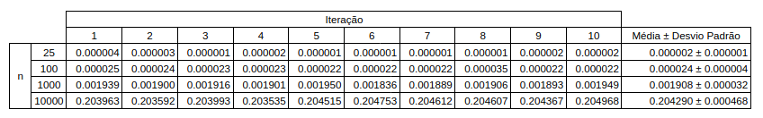

Projeto para matéria de Laboratório de Introdução à Ciência da Computação II (SCC0220) para o curso de Ciências de Computação da USP São Carlos.

# Relatório de Comparação de Algoritmos de Ordenação
O código executa algoritmos de ordenação e tem como resultado arquivos para análise e composição de relatório comparativo entre os métodos.

É executado os algoritmos de ordenação definidos em `ordenacao`. 

Cada algoritmo é executado múltiplas vezes tendo o tamanho da entrada (`n`) variado de `n=25` até `n=TAMANHO_DE_VETOR_MAXIMO` com incremento de `5`.  
Para cada `n`, é executado `QUANTIDADE_DE_TESTES` vezes o algoritmo de ordenação sobre o mesmo vetor, e a média do tempo de execução é considerada o tempo de execução final para o respectivo valor de `n`.

Além disso, dependendo dos argumentos de execução, o tipo do vetor pode variar entre aleatório, ordenado (crescente), ordenado invertido (decrescente) ou os 3.

Como saída, o código tem 2 tipos de arquivos:
1. Arquivo `.dat`  
Para cada algoritmo de ordenação e para cada tipo de vetor, é um arquivo no formato `(n, tempo de execução)`. Ou seja, contém a relação de, para um determinado valor de `n`, qual foi o tempo de execução final. 
2. Arquivo `.csv`  
Para cada algoritmo de ordenação e para cada tipo de vetor, é um arquivo que imprime uma tabela contendo o tempo de execução de cada `QUANTIDADE_DE_TESTES` execução, a média e o desvio padrão para os valores `n=25`, `n=100`, `n=1000`, `n=10000`. 

## Arquivos de saída

### Arquivo .dat 

O arquivo `.dat` está formatado de forma que seja facilmente plotado no `gnuplot` (https://www.cs.hmc.edu/~vrable/gnuplot/using-gnuplot.html).

São exemplos de arquivos:
```
bubble_sort-aleatorio.dat
bubble_sort-ordenado_inverso.dat
bubble_sort-ordenado.dat
insertion_sort-aleatorio.dat
...
```

Exemplo do conteúdo do arquivo:
```
25	0.000002
30	0.000002
35	0.000003
...
9995	0.203552
10000	0.204290
```

Para que seja plotado, é necessário entrar na pasta onde o arquivo está contido.  
O código abaixo define configurações básicas do `gnuplot`:
```
gnuplot
set grid
set title "Metodos de Ordenacao"
set xlabel "Quantidade de elementos (n)"
set ylabel "Tempo de execucao em segundos (t)"
set yrange[0:0.3]
# set yrange[0:0.0003]
```

Por fim, códigos para plot de cada método de ordenação:

- Bubble Sort
```
set title "Bubble Sort"

plot "bubble_sort-aleatorio.dat" title "Aleatorio"
plot "bubble_sort-ordenado.dat" title "Ordenado"
plot "bubble_sort-ordenado_inverso.dat" title "Ordenado Invertido"

plot "bubble_sort-aleatorio.dat" title "Aleatorio", "bubble_sort-ordenado.dat" title "Ordenado", "bubble_sort-ordenado_inverso.dat" title "Ordenado Invertido"
```

- Insertion Sort
```
set title "Insertion Sort"

plot "insertion_sort-aleatorio.dat" title "Aleatorio"
plot "insertion_sort-ordenado.dat" title "Ordenado"
plot "insertion_sort-ordenado_inverso.dat" title "Ordenado Invertido"

plot "insertion_sort-aleatorio.dat" title "Aleatorio", "insertion_sort-ordenado.dat" title "Ordenado", "insertion_sort-ordenado_inverso.dat" title "Ordenado Invertido"
```

- Merge Sort
```
set title "Merge Sort"

plot "merge_sort-aleatorio.dat" title "Aleatorio"
plot "merge_sort-ordenado.dat" title "Ordenado"
plot "merge_sort-ordenado_inverso.dat" title "Ordenado Invertido"

plot "merge_sort-aleatorio.dat" title "Aleatorio", "merge_sort-ordenado.dat" title "Ordenado", "merge_sort-ordenado_inverso.dat" title "Ordenado Invertido"
```

- Heap Sort
```
set title "Heap Sort"

plot "heap_sort-aleatorio.dat" title "Aleatorio"
plot "heap_sort-ordenado.dat" title "Ordenado"
plot "heap_sort-ordenado_inverso.dat" title "Ordenado Invertido"

plot "heap_sort-aleatorio.dat" title "Aleatorio", "heap_sort-ordenado.dat" title "Ordenado", "heap_sort-ordenado_inverso.dat" title "Ordenado Invertido"
```

E códigos para plot de comparação entre os métodos de ordenação com diferente tipos de vetores:
```
plot "bubble_sort-aleatorio.dat" title "Bubble Sort", "insertion_sort-aleatorio.dat" title "Insertion Sort", "merge_sort-aleatorio.dat" title "Merge Sort"

plot "bubble_sort-ordenado.dat" title "Bubble Sort", "insertion_sort-ordenado.dat" title "Insertion Sort", "merge_sort-ordenado.dat" title "Merge Sort"

plot "bubble_sort-ordenado_inverso.dat" title "Bubble Sort", "insertion_sort-ordenado_inverso.dat" title "Insertion Sort", "merge_sort-ordenado_inverso.dat" title "Merge Sort"
```

### Arquivo .csv

O arquivo `.csv` está formatado para gerar uma tabela no seguinte formato:

```   
            1  2  3  4  5  6  7  8  9  10 | Média ± Desvio Padrão
25          
10                 tempo para n no teste t
100
10000
```

São exemplos de arquivos:
```
bubble_sort-aleatorio.csv
bubble_sort-ordenado_inverso.csv
...
```

Exemplo do conteúdo do arquivo:
```
,,Iteração,,,,,,,,,,
,,1,2,3,4,5,6,7,8,9,10,Média ± Desvio Padrão
n,25,0.000004,0.000003,0.000001,0.000002,0.000001,0.000001,0.000001,0.000001,0.000002,0.000002,0.000002 ± 0.000001
,100,0.000025,0.000024,0.000023,0.000023,0.000022,0.000022,0.000022,0.000035,0.000022,0.000022,0.000024 ± 0.000004
,1000,0.001939,0.001900,0.001916,0.001901,0.001950,0.001836,0.001889,0.001906,0.001893,0.001949,0.001908 ± 0.000032
,10000,0.203963,0.203592,0.203993,0.203535,0.204515,0.204753,0.204612,0.204607,0.204367,0.204968,0.204290 ± 0.000468
```

Na pratica, a ideia é que o `.csv` seja utilizado para gerar uma tabela que pode ser colocada no relatório.  
Para isso, basta importar o arquivo em um Excel, formatar e imprimir como PDF.   
Exemplo:


## Requisitos
Para que o código armazene os arquivos de saida de forma organizada, é necessário criar uma pasta chamada `resultados`. 

Dentro da pasta `resultados` é necessário criar uma pasta para cada algoritmo de ordenação, sendo que o nome da pasta é o nome definido no `DEFINE` no arquivo `ordenacoes.h`. Nesta pastas serão armazenados os códigos `.dat`.

Além disso, é necessário criar uma pasta dentro de `resultados` chamada `testes` onde serão armazenados os arquivos `.csv`.

Exemplo de estrutura dos diretórios:
```
resultados
├── bubble_sort
│   ├── bubble_sort-aleatorio.dat
│   ├── bubble_sort-ordenado.dat
│   ├── bubble_sort-ordenado_inverso.dat
├── insertion_sort
│   ├── insertion_sort-aleatorio.dat
│   ├── insertion_sort-ordenado.dat
│   ├── insertion_sort-ordenado_inverso.dat
├── merge_sort
│   ├── merge_sort-aleatorio.dat
│   ├── merge_sort-ordenado.dat
│   ├── merge_sort-ordenado_inverso.dat
└── testes
    ├── bubble_sort-aleatorio.csv
    ├── bubble_sort-ordenado.csv
    ├── bubble_sort-ordenado_inverso.csv
    ├── insertion_sort-aleatorio.csv
    ├── insertion_sort-ordenado.csv
    ├── insertion_sort-ordenado_inverso.csv
    ├── merge_sort-aleatorio.csv
    ├── merge_sort-ordenado.csv
    ├── merge_sort-ordenado_inverso.csv
```

## Execução

Remover arquivos `.o`:
```
make clean
```

Compilar:
```
make
```

O sistema permite dois tipos de execução:
1. Informando o tipo de vetor que será fornecido para os algoritmos (aleatório,ordenado e ordenado invertido);
2. Não informando o tipo de vetor que será fornecido para os algoritmos. Neste caso, os 3 tipos serão fornecidos.

Para o modo 1, execute o seguite comando:
```
./relatorio [tipo_de_vetor] > .out
```
Sendo tipo_de_vetor = 1 se aleatório, tipo_de_vetor = 2 se ordenado (crescente) e tipo_de_vetor = 3 se ordenado invertido (decrescente). Exemplo:
```
./relatorio 1 > .out
```

Para o modo 2, execute o seguinte comando:
```
./relatorio > .out
```

## Tutorial

### Como adicionar um novo método de ordenação?
Para adicionar um novo método de ordenação, é necessário fazer modificações em 3 arquivos: `ordenacoes.h`, `ordenacoes.c` e `relatorio.c`.

1. `ordenacoes.h`  
i. Defina uma variável `ORDENACAO[ID]` com o ID da ordenação;  
ii. Defina uma variável `ORDENACAO[ID]_NOME` com o nome da ordenação. Este nome será o nome da pasta em `resultados`;  
iii. Adicione a assinatura da função do algoritmo de ordenação.

2. `ordenacoes.c`  
i. Adicione a função do algoritmo de ordenação;   
ii. Retorne o nome da ordenação com base no ID na função `nome_ordenacao_por_codigo`.

3. `relatorio.c`  
i. Na função `executar_testes`, defina `cria_arquivo_dat` e `cria_arquivo_csv`;  
ii.  Defina o `vetor_ordenacao`;  
iii. Defina `tempo_de_execucao_ordenacao` e `soma_ordenacao`;  
iv. Defina `ordenar` e configure a função;  
v. Definir e calcular `media_ordenacao` e `desvio_padrao_ordenacao`;  
vi. Definir `escrever_dat` e `escrever_csv`;  
vii. Definir liberação de memória.